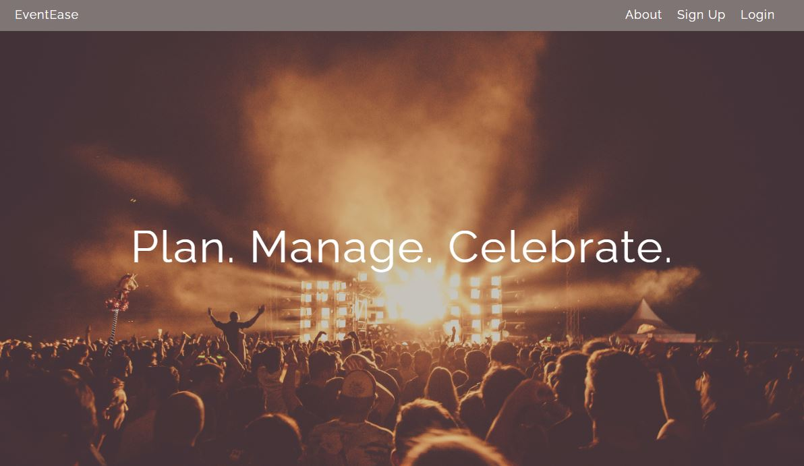

# EventEase

## Event Manager

Welcome to the Event Manager App! This platform allows users to organize and track all their events seamlessly. Whether you're planning a party, attending a meeting, or tracking important dates, our app provides everything you need to manage your events effectively.

### Features:

User Profiles: Create a personalized profile to manage your events, view your schedule, and keep track of invitations.

Event Creation: Easily create new events, set details like date, time, and location, and invite guests.

Calendar View: View all your upcoming events in a calendar format, making it easy to plan ahead.

### How it works:

Track Events: View all your events, including upcoming ones, at a glance.

Create Events: Set up new events with all the necessary details, invite guests, and keep everything organized.

Interact: Stay engaged with event hosts and attendees, respond to invitations, and share your own events.

Plan Ahead: Use the calendar view to see what's coming up and ensure you're prepared for every event.

## Have a look!

/////////////////////////////////////// NEED TO ADD 

## Attributions

https://docs.python.org/3.11/library/calendar.html 

https://fontawesome.com/

https://css-tricks.com/snippets/css/a-guide-to-flexbox/ 

https://alexpnt.github.io/2017/07/15/django-calendar/ 

https://tailwindcss.com/ 

https://dribbble.com/ 

https://fonts.google.com/ 

https://unsplash.com/ 

## Built with

* Python
* Javascript
* HTML
* CSS
* Tailwind
* Postgresql
* Django

## Next Steps

Enable users to choose a background image for the event they create.
Add a checklist for the event creator for things that need to be completed for the event.
